# 사용자 Manual

##### 1) "기똥차"라는 이름의 apk 파일을 설치하고 실행한다.

##### 2) 애플리케이션을 실행하면 어떤 기능을 실행할지 음성으로 묻는다. 도우미 버전에서는 음성이 아닌 시각 기반의 UI를 사용해 기능을 실행할 수 있다.

##### 3) “길 안내”라고 대답하면 길 안내 기능을 시작하며 현재 있는 곳을 음성으로 물어본다. 사용자는 현재 있는 곳을 대답한다.

 

##### 4) 사용자의 대답을 인식한 후 다시 사용자의 대답이 올바르게 인식되었는지 물어본다. “네”라고 대답하면 다음 순서로 넘어간다.

  

##### 5) 사용자의 현재 위치가 인식된 다음에는 목적지를 설정한다. “목적지를 말해주세요”라는 음성이 들리면 목적지를 말한다. 목적지를 올바르게 인식했는지 확인하는 음성이 들리고 올바르게 인식되었으면 “네”라고 대답하면 경로탐색을 시작한다.

  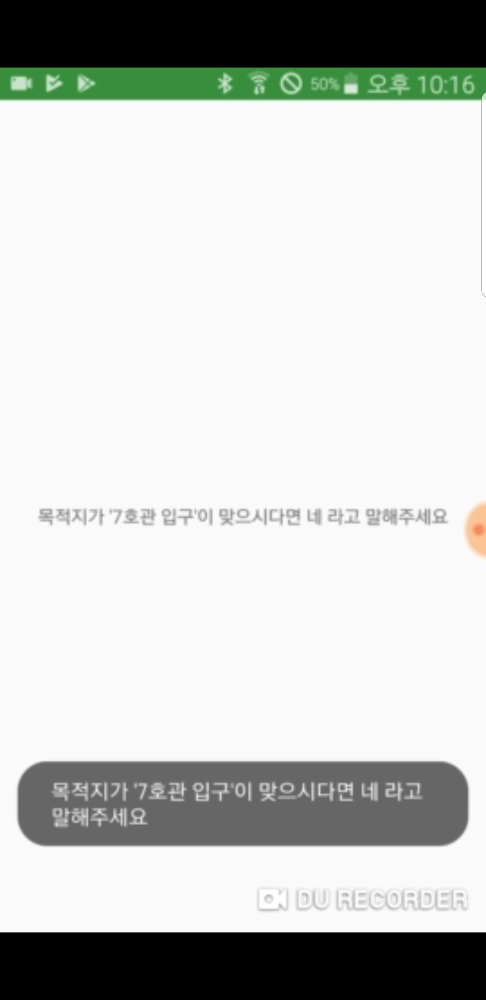

##### 6) 경로탐색을 시작하고 경로탐색이 되면 길안내를 시작한다. 목적지에 도착하면 길안내를 종료한다는 음성안내를 하고 길 안내가 종료된다.

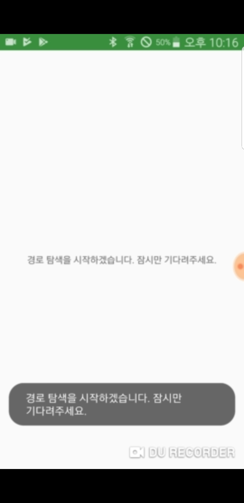  

# 도우미 Manual

##### 1) "기똥차"라는 이름의 apk 파일을 설치하고 실행한다.

2) 어플리케이션을 실행하여 '도우미 버전' 이라고 말하면 맵을 확인할 수 있다. 서버로부터 전송받은 노드 데이터가 맵에 빨간 마커로 점자보도 블럭의 노드들이 표시되고 마커를 누르면 노드 정보를 확인할 수 있다.

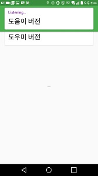 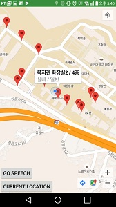

3) 마커가 표시되지 않은 지도에 원하는 위치를 누르면 새로운 마커가 표시된다.

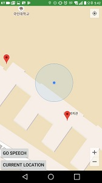 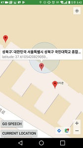

4) 마커를 길게 누르면 마커 및 노드 데이터를 수정 및 삭제할 수 있다. 수정 버튼을 누르면 다음과 같은 입력창을 확인하게 된다. 입력란과 버튼으로 데이터를 수정할 수 있다.

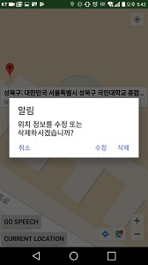 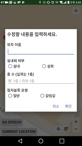 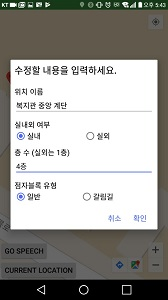 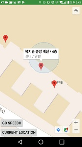

5) 맵 화면의 왼쪽 하단의 "GO SPEECH" 버튼을 눌러 기본화면으로 넘어간다. 이후 다시 지도 화면으로 접속하면 새롭게 추가한 마커와 해당 노드 데이터가 그대로 저장되어 있는 것을 확인할 수 있다.

 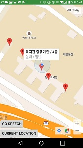

6) 원하는 마커를 수정한뒤에 원하면 이웃노드 관계를 설정할 수 있다. 삭제 버튼을 누르면 해당 마커와 노드 데이터가 사라지는것을 확인할 수 있다.

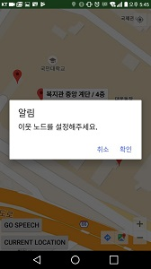 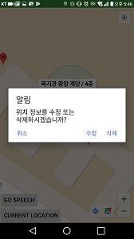 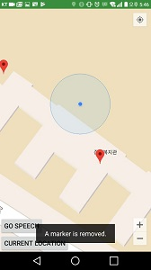

