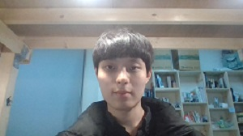
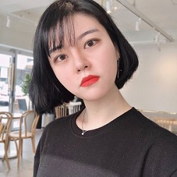

## 기똥차

2019년 캡스톤 디자인 1조

### 1. 프로젝트 소개

------

본 프로젝트는 시각장애인 안내견의 기능을 대체, 보완할 임베디드 시스템을 개발하는 것을 목표로 한다. 시각장애인이 이 시스템을 사용하면 점자 보도블록을 따라 자율주행하는 구동체를 따라 안전하게 보행할 수 있으며 횡단보도를 차도로 벗어나지 않고 안전하게 건널 수 있다. 커뮤니티 매핑으로 제작된 점자 블록 지도를 통해 최적의 경로를 보행할 수 있으며, 주변에 인식되는 장애물을 음성으로 안내받을 수 있다. 또한 이 구동체는 음성인식을 통하여 조작할 수 있다. 

### 2. Abstract

------

Our project is to develop a road guidance system for people who are blind who have difficulty moving to places. In view of the inconvenience and practical problems of the existing blind guide dogs, we will provide a more convenient and efficient guide service. First, the system provides a voice interface system through the application. Second, it provides accurate and safe route guidance through the drive Third, manage node data for Braille Block Map and explore the shortest path using the directions algorithm through the server. 

There are some difficulties in implementing this system, but our team will overcome them one by one, and we hope that these research and development will become a developed service for the better life of the blind.

### 3. 소개영상

------

<iframe width = "640" height = "360" src = "https://youtu.be/G3Q03miDkMk">
</iframe>

### 4. 팀 소개

------

###### Professor

- 윤성혜 교수님

##### 1. 팀장

김용태

*#학번*     20143042

*#E-mail*  yongtae0114@gmail.com

*#역할*     Project Leader, Application 개발, App-Car / App-Server 통신

##### 2. 팀원

성종욱

*#학번*     20143069

*#E-mail*  ypwa121@gmail.com

*#역할*     Application 개발, 음성인식 API, 지도 API

##### 3. 팀원

송영은

*#학번*     20163118

*#E-mail*  522818@naver.com

*#역할*     영상처리, Application Design

##### 4. 팀원

송성유

*#학번*     20163117

*#E-mail*  thdtjddb@naver.com

*#역할*     Map Data Structure 개발, 자율주행 기능 개발

##### 5. 팀원

유영준

*#학번*     20152843

*#E-mail*  junyoo96@gmail.com

*#역할*     서버 개발, 데이터베이스 관리

### 5. 사용법

------

소스코드제출시 업로드 예정

### 6. 기타

------

`불꽃카리스마 열정 가득한 팀입니다.`
